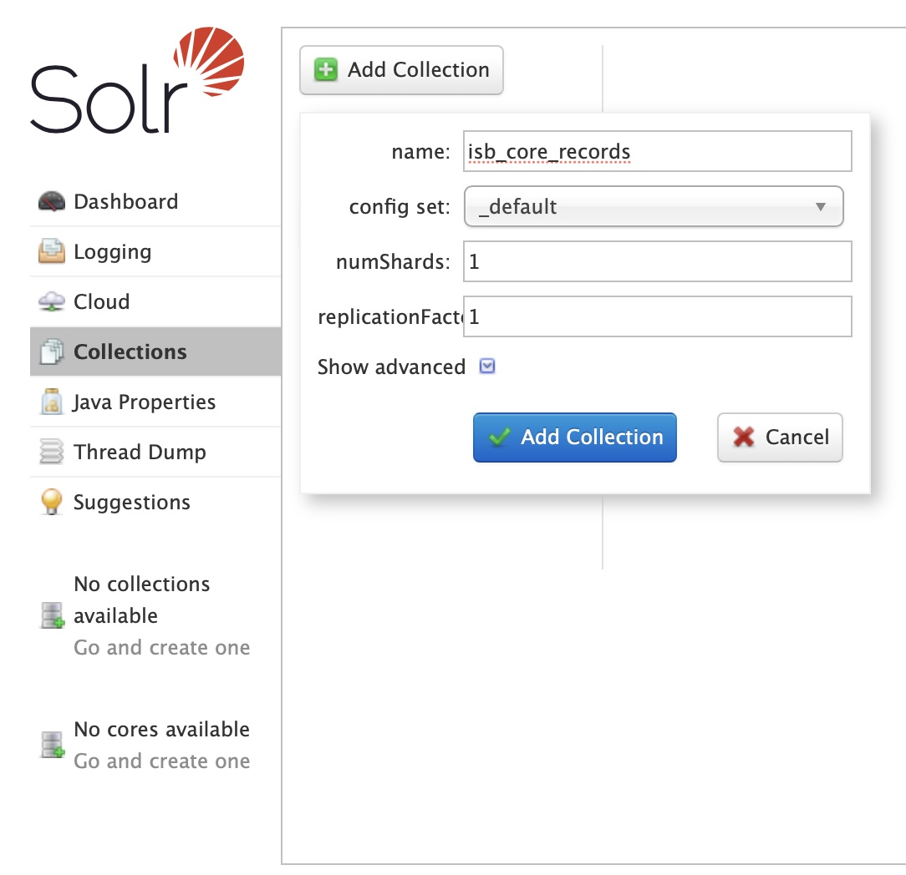

# isamples_docker
Location to store resources needed to build iSamples Docker containers
## How to build container
First initialize the submodules so you have iSamples in a box pulled in correctly:
`git submodule init`
`git submodule update`

Then run the docker build: `docker-compose up --build`

This should have brought up the containers

## How to ping it to see if it's working
At this point, you should have a running iSamples in a Box container.  You can manually open the docs and use the interactive UI by pinging: http://localhost:8000/docs.  From there, you should be able to interactively hit the various API methods.

## How to set up Solr
Next, you need to manually create the solr collection -- it's bound to port 8983, so open the admin UI and do it by hand on http://localhost:8983

Then once that is done, you want to manually create the schema by running the python script in the iSB container.

* Find the iSB Docker container like this:
    `docker ps`
* Run bash in the iSB container like this:
    `docker exec -it 8743be6ee2f1 bash`
* Manually create the solr schema by running the python create solr script:
    `python solr_schema_init/create_isb_core_schema.py`

### Manually run an import
* Find the iSB Docker container like this:
    `docker ps`
* Run bash in the iSB container like this:
    `docker exec -it 8743be6ee2f1 bash`
* Once inside bash, export PYTHONPATH to our container install directory (not quite sure why this is required)
    `export PYTHONPATH=/app`
* Run a db import:
    `python scripts/opencontext_things.py --config ./isb.cfg load -m 1000`
* Run a solr import once the db is done:
    `python scripts/opencontext_things.py --config ./isb.cfg populate_isb_core_solr -m 1000`
